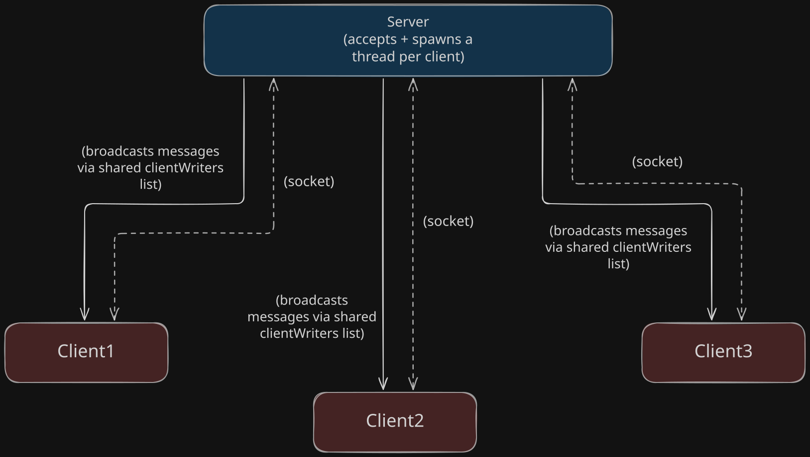

# cli-chat-java

A multithreaded CLI chat application built from raw Java sockets — a server that accepts multiple concurrent clients and broadcasts messages between them in real time.

Built as a learning project to understand sockets and concurrency (threads, shared state, race conditions) before moving on to web frameworks.

## Features

- Multiple clients can connect and chat at once — not just one client at a time
- One dedicated thread per connected client, so no client's input blocks another's
- Real-time broadcast: a message from any client is sent to every other connected client
- Username handshake on connect — messages are attributed to a name, not an anonymous ID
- `/quit` command for a graceful, intentional disconnect (vs. a dropped connection)
- Timestamped messages (`[HH:mm:ss] username says: ...`)
- A max-client limit — once the server is full, new connections get a "Server full" message and are closed rather than silently accepted

## Requirements

- Java (JDK 17+ recommended)
- No external dependencies — everything used is part of core Java (`java.net`, `java.io`, `java.util.concurrent`)

## Running it

This needs the server and at least one client running as **separate processes**, so you'll want two or more terminal windows (or IntelliJ run configurations).

1. **Start the server first:**
   ```
   java com.adesidaleye.chat.Server
   ```
   You should see `Server started on port 8080`.

2. **Start one or more clients** (each in its own terminal/run configuration):
   ```
   java com.adesidaleye.chat.Client
   ```
   Each client will be prompted for a username on connect.

3. Type a message and hit Enter in any client — it'll be broadcast to every other connected client, with a timestamp and your username attached.

4. Type `/quit` in a client to disconnect gracefully — other clients will see `"<username> has left chat."`

## Architecture



**The core design idea:** each connected client gets its own thread on the server, so one slow or quiet client never blocks another. All those threads share one list (`clientWriters`) — when any client sends a message, that client's thread loops through the *entire* shared list and writes the message to every connected client's output stream. `CopyOnWriteArrayList` is used specifically because multiple threads add/remove/iterate over this list concurrently — a plain `ArrayList` isn't safe under that kind of concurrent access.

**On the client side**, each client process splits into two threads of its own: one that only reads from the keyboard and sends, and one that only reads from the socket and prints incoming broadcasts. This split exists because a single thread can't simultaneously block on "wait for me to type" and "wait for an incoming message" — splitting them is what lets a client receive a message while the user is still composing their own.

## Possible future improvements

- Private messaging (`/msg username text`)
- Fixing the console interleaving issue (e.g. reprinting the input prompt after an incoming message)
- Persisting chat history to a file